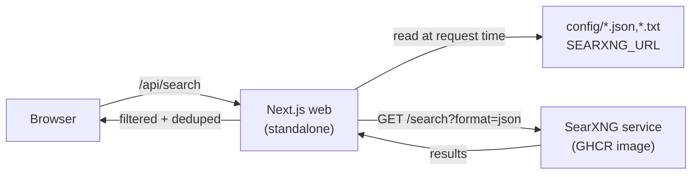

<div align="center">
  

  <h1>Searchtastic</h1>

  <p><strong>A filtered metasearch frontend for self-hosted SearXNG.</strong></p>

  <p>Search-first Next.js 16 app that proxies a SearXNG instance, dedupes results, and lets you steer them with whitelists, blacklists, saved lenses, and keyboard shortcuts.</p>

  <p>
    <a href="https://nextjs.org"></a>
    <a href="https://react.dev"></a>
    <a href="https://www.typescriptlang.org"></a>
    <a href="https://tailwindcss.com"></a>
    <a href="https://base-ui.com"></a>
    <a href="https://docs.searxng.org"></a>
    <a href="https://railway.app"></a>
    <a href="https://pnpm.io"></a>
  </p>
</div>

---

## Why

Mainstream search engines optimise for revenue, not relevance. Searchtastic is a personal layer on top of a self-hosted [SearXNG](https://docs.searxng.org) — same multi-engine reach, but with per-search domain rules, saved filter presets ("lenses"), and a UI that stays out of the way until you type.

## Features

- **Search-first hero** that collapses to a sticky bar after the first query
- **Single-select category tabs** (`All · general · images · news · code · …`) that re-search on click
- **Filters drawer** with engines, language, time range, safe-search, plugins, image proxy
- **Lenses** — saved filter presets in `localStorage`, switchable in one click
- **Active-filter chips** under the input so it's always clear what's narrowing the results
- **Settings modal** for per-scope domain whitelists and blacklists (global, per-category, per-engine)
- **Keyboard-first**: `/` focus, `j/k` walk, `enter` open, `f` filters, `?` shortcuts
- **Bookmarkable URLs** — the active query lives in `?q=…` so back-button and direct links work
- **CSV / RSS export** of the current result set

## Tech stack

|  |  |
| --- | --- |
| **Framework** | [Next.js 16](https://nextjs.org) — App Router, server components, force-dynamic root layout |
| **UI** | shadcn/ui v4 over [`@base-ui/react`](https://base-ui.com), [Tailwind CSS v4](https://tailwindcss.com) (OKLCH theme tokens) |
| **Language** | [TypeScript 5](https://www.typescriptlang.org) strict |
| **Fonts** | Geist Sans / Geist Mono (body), Fraunces (serif headings, optical sizing) |
| **Search backend** | [SearXNG](https://docs.searxng.org) JSON API |
| **Deployment** | [Railway](https://railway.app) — two Docker services |
| **Runtime** | Node 24, pnpm 10 |

## Quick start

```bash
pnpm install
cp .env.example .env.local
# point SEARXNG_URL at your SearXNG instance
pnpm dev
```

Verify the SearXNG backend speaks JSON:

```bash
curl "$SEARXNG_URL/search?q=test&engines=google,bing&format=json"
```

## Configuration

Three runtime files under `config/`:

| File | Purpose |
| --- | --- |
| `config/search-engines.json` | UI catalog of engines (`id`, `name`, `category`, default-enabled flag) |
| `config/whitelist.txt` | Base whitelist — one domain per line, `#` for comments |
| `config/blacklist.txt` | Base blacklist — one domain per line, `#` for comments |

User-side overrides (per-scope rules and saved lenses) live in `localStorage` and are managed from the in-app **Settings** modal and the **Filters** drawer.

## Architecture



Request flow:

1. Root layout reads engines and domain lists server-side, passes them to client components via React context.
2. On submit, the client posts to `/api/search` (Next.js Route Handler).
3. The handler validates input, calls SearXNG's JSON endpoint, dedupes by URL, applies blacklist + whitelist mode + per-scope rules, and returns `{ results, stats, meta }`.

## Keyboard shortcuts

| Key | Action |
| --- | --- |
| <kbd>/</kbd> | Focus the search input |
| <kbd>j</kbd> / <kbd>k</kbd> | Move focus to next / previous result |
| <kbd>Enter</kbd> | Open the focused result |
| <kbd>f</kbd> | Open the Filters drawer |
| <kbd>?</kbd> | Show the shortcuts modal |
| <kbd>Esc</kbd> | Close panel or clear focus |

## Deployment (Railway)

Two services, both built from Dockerfiles in this repo.

### 1. SearXNG

Build from `deploy/searxng/Dockerfile` (extends `ghcr.io/searxng/searxng:latest` with the local `settings.yml`).

Required env:

```bash
SEARXNG_SECRET=<long-random-string>
SEARXNG_BASE_URL=https://<your-searxng-domain>/
```

Verify JSON output once deployed:

```bash
curl "https://<your-searxng-domain>/search?q=test&format=json"
```

### 2. Web

Build from the root `Dockerfile` (multi-stage `node:24-alpine`, runs `next start` from `.next/standalone`).

Required env:

```bash
SEARXNG_URL=https://<your-searxng-domain>
```

Deploy the web service after SearXNG is reachable. The app reads `SEARXNG_URL` at request time, so no rebuild needed when the URL changes.

## Project layout

```
src/
├── app/
│   ├── layout.tsx        # server-side config fetch + AppConfigProvider
│   ├── page.tsx          # <Suspense> wrapper around <SearchApp />
│   ├── icon.svg          # favicon (amber square + magnifying glass)
│   ├── loading.tsx, error.tsx, not-found.tsx
│   └── api/search/route.ts
├── components/
│   ├── search-app.tsx    # main client component
│   ├── domain-rules-editor.tsx
│   └── ui/               # shadcn primitives over Base UI
└── lib/search/
    ├── config.ts, types.ts
    ├── searxng.ts        # JSON client
    ├── filter.ts         # dedup + whitelist/blacklist logic
    └── config-context.tsx
```
